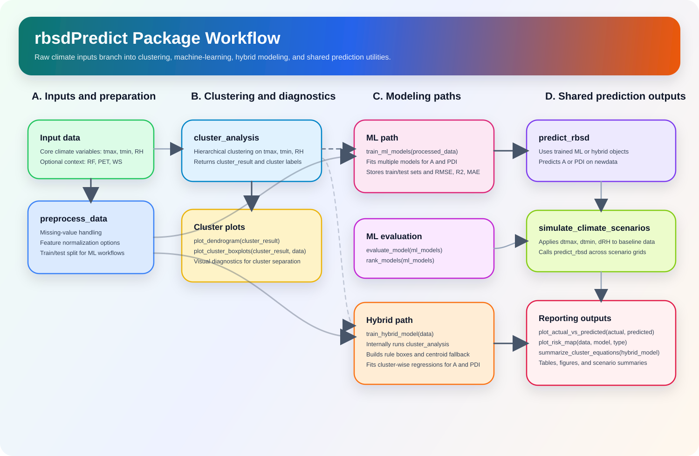
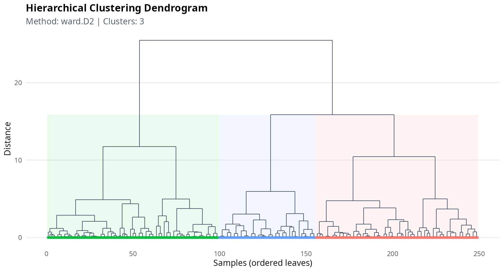
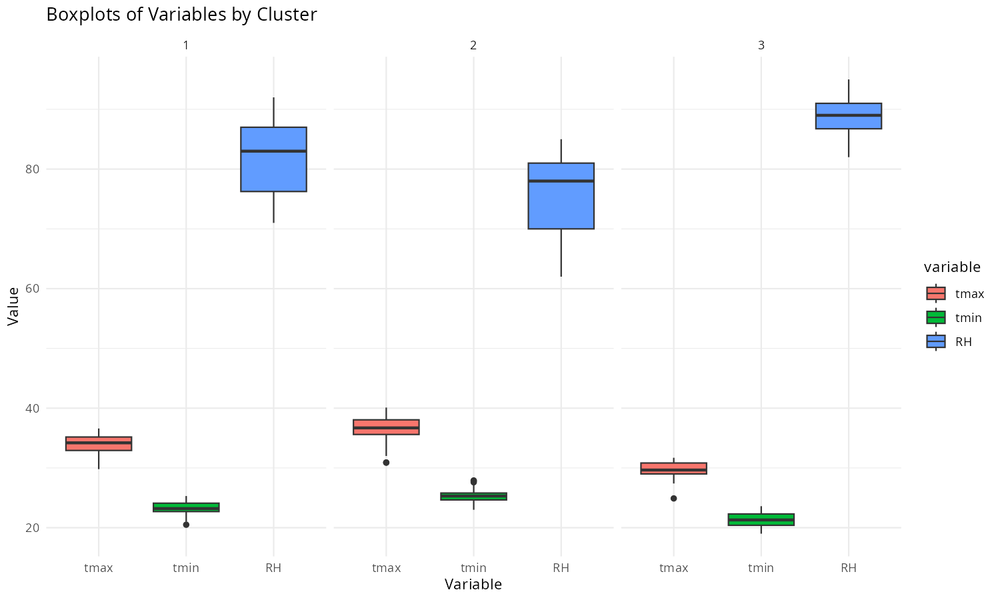
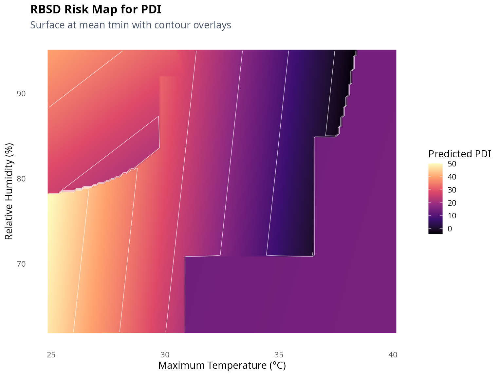
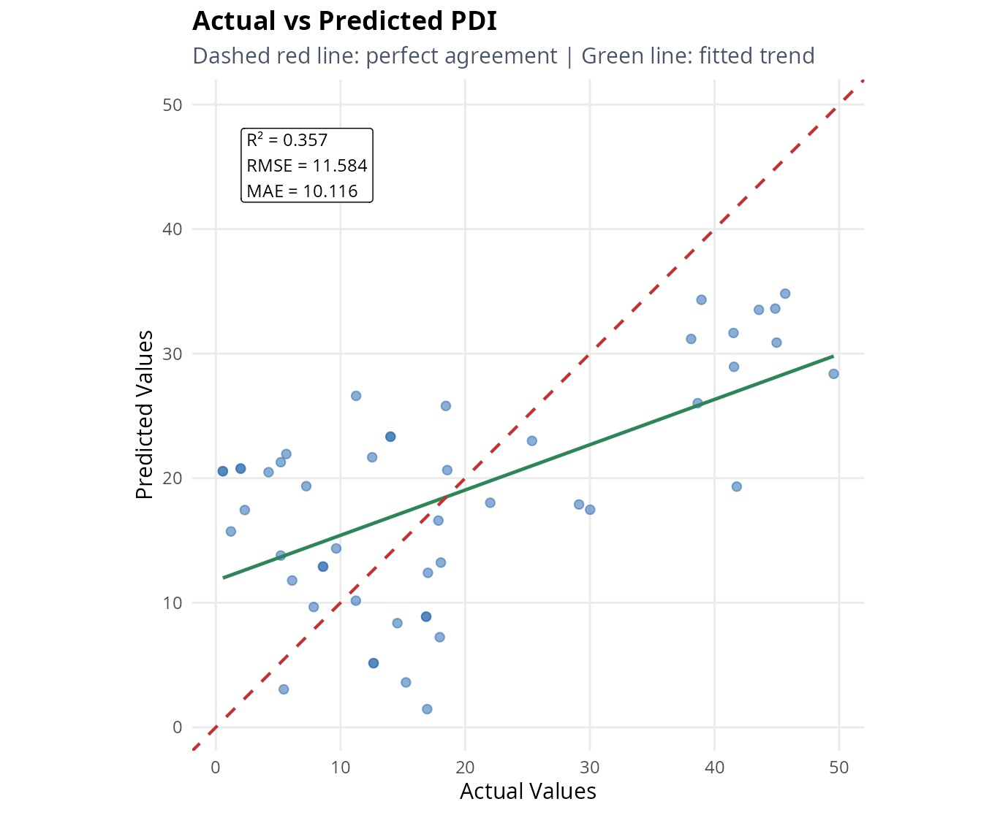

# rbsdPredict: AI-Driven Rice Brown Spot Disease Forecasting

## Overview
`rbsdPredict` is an open-source R package developed from the study:

**Integrating Artificial Intelligence and Climate Data for Predicting Rice Brown Spot Disease Dynamics**

The package supports end-to-end RBSD analysis:
- preprocessing meteorological and disease data,
- clustering climate regimes,
- training machine learning and hybrid models,
- generating predictions for aerospora contribution (`A`) and disease intensity (`PDI`),
- visualizing risk behavior through interpretable plots.

## Core Equations Used in the Workflow

### 1) Airspora contribution

$$
A = \frac{C_{B.oryzae}}{C_{Total}} \times 100
$$

where $C_{B.oryzae}$ is the number of *B. oryzae* colonies and $C_{Total}$ is the total colony count.

### 2) Percent Disease Index (PDI)

$$
\mathrm{PDI} = \frac{\sum \text{disease ratings}}{(N \times \text{maximum rating})} \times 100
$$

where $N$ is the number of observed units.

### 3) Cluster-wise linear model (hybrid)

$$
Y = \beta_0 + \beta_1 \cdot tmax + \beta_2 \cdot tmin + \beta_3 \cdot RH + \epsilon
$$

with $Y \in \{A, PDI\}$.

### 4) Hybrid cluster assignment and fallback equations

For each cluster $c$, rules store min-max ranges and centroid statistics for $(tmax, tmin, RH)$.

Primary rule-based assignment:

$$
	ext{if } x_j \in [\min_{c,j}, \max_{c,j}] \; \forall j \in \{tmax,tmin,RH\}, \text{ assign cluster } c
$$

Fallback nearest-centroid assignment (standardized Euclidean distance):

$$
d_c = \sqrt{\sum_{j \in \{tmax,tmin,RH\}}\left(\frac{x_j - \mu_{c,j}}{\sigma_{c,j}}\right)^2},
\qquad
\hat{c} = \arg\min_c d_c
$$
In the package implementation, if a cluster-specific standard deviation is `NA` or `0`, it is replaced by `1` before computing $d_c$ so the fallback distance is always defined.

Then cluster-specific regressions are used:

$$
\hat{A} = \alpha_{0,\hat{c}} + \alpha_{1,\hat{c}}\,tmax + \alpha_{2,\hat{c}}\,tmin + \alpha_{3,\hat{c}}\,RH
$$

$$
\widehat{PDI} = \gamma_{0,\hat{c}} + \gamma_{1,\hat{c}}\,tmax + \gamma_{2,\hat{c}}\,tmin + \gamma_{3,\hat{c}}\,RH
$$

### 5) Evaluation metrics

$$
\mathrm{RMSE} = \sqrt{\frac{1}{n}\sum_{i=1}^{n}(y_i - \hat{y}_i)^2}, \quad
R^2 = 1 - \frac{\sum_{i=1}^{n}(y_i - \hat{y}_i)^2}{\sum_{i=1}^{n}(y_i - \bar{y})^2}
$$

## Package Workflow (Flowchart)



This workflow reflects the current package implementation more precisely:
- `preprocess_data()` feeds the machine-learning path.
- `train_hybrid_model()` performs clustering and cluster-wise regressions internally.
- `cluster_analysis()`, `plot_dendrogram()`, and `plot_cluster_boxplots()` can also be used as standalone exploratory tools.
- `predict_rbsd()` and `simulate_climate_scenarios()` work downstream of trained ML or hybrid models.

The flowchart is also editable from an ignored local utility workspace in `utility/`, so you can restyle it without cluttering the repository.

## Example Figures

### Hierarchical clustering dendrogram



This dendrogram is rendered with `ggplot2` styling and cluster-highlight bands.

### Cluster-wise boxplots



### Risk map for predicted PDI



The risk map uses smooth raster interpolation plus contour isolines for clearer gradients.

### Actual vs predicted (PDI)



The plot includes a perfect-agreement line, fitted trend, and diagnostics ($R^2$, RMSE, MAE).

## Installation

```r
install.packages("devtools")
devtools::install_local("/path/to/rbsdPredict")
```

## Quick Start

```r
library(rbsdPredict)

data(rbsd_data)

# 1) Preprocess data (normalize predictors, keep targets in original units)
processed <- preprocess_data(rbsd_data, handle_missing = "impute", normalize = TRUE)

# 2) Train ML models
ml_models <- train_ml_models(
	processed,
	models = c("lm", "rf", "xgbTree", "knn", "svm", "nnet")
)

# 3) Compare models
evaluation <- evaluate_model(ml_models)
leaderboard <- rank_models(ml_models, metric = "RMSE")
print(leaderboard)

# 4) Predict A and PDI
pred_A <- predict_rbsd(ml_models, processed$test_features, type = "A")
pred_PDI <- predict_rbsd(ml_models, processed$test_features, type = "PDI")

# 5) Plot predictions
plot_actual_vs_predicted(processed$test_targets$A, pred_A, "A")
plot_actual_vs_predicted(processed$test_targets$PDI, pred_PDI, "PDI")
```

## Hybrid Modeling and Interpretability

```r
library(rbsdPredict)
data(rbsd_data)

hybrid <- train_hybrid_model(rbsd_data, n_clusters = 3)

# Extract readable cluster equations for A and PDI
eq_table <- summarize_cluster_equations(hybrid)
print(eq_table)

# Visual diagnostics
plot_dendrogram(hybrid$cluster_result)
plot_cluster_boxplots(hybrid$cluster_result, rbsd_data[, c("tmax", "tmin", "RH")])
```

## Scenario Analysis for Climate Change Questions

```r
library(rbsdPredict)
data(rbsd_data)

processed <- preprocess_data(rbsd_data)
ml_models <- train_ml_models(processed, models = c("lm", "rf", "xgbTree"))

scenario_grid <- expand.grid(
	dtmax = c(-1, 0, 1, 2),
	dtmin = c(-1, 0, 1),
	dRH = c(-5, 0, 5)
)

sim <- simulate_climate_scenarios(
	model = ml_models,
	baseline_data = rbsd_data[, c("tmax", "tmin", "RH")],
	scenario_grid = scenario_grid,
	type = "PDI"
)

head(sim$scenario_summary)
```

## Suggested Plot Set for Reporting

The package is designed to support the same visual narrative used in your article:
- dendrogram for climate-cluster separation,
- boxplots by cluster for `tmax`, `tmin`, `RH`,
- actual vs predicted plots for `A` and `PDI`,
- risk-map heatmap under baseline or scenario climate inputs.

```r
library(rbsdPredict)
data(rbsd_data)

processed <- preprocess_data(rbsd_data)
ml_models <- train_ml_models(processed, models = c("rf", "xgbTree", "lm"))

p1 <- plot_actual_vs_predicted(
	processed$test_targets$A,
	predict_rbsd(ml_models, processed$test_features, "A"),
	"A"
)

p2 <- plot_actual_vs_predicted(
	processed$test_targets$PDI,
	predict_rbsd(ml_models, processed$test_features, "PDI"),
	"PDI"
)

p3 <- plot_risk_map(rbsd_data[, c("tmax", "tmin", "RH")], ml_models, "PDI")

print(p1)
print(p2)
print(p3)
```

## Functions Added for Usability

- `rank_models()`: target-wise leaderboard using RMSE, R2, or MAE.
- `summarize_cluster_equations()`: readable cluster-wise regression equations for hybrid models.
- `simulate_climate_scenarios()`: what-if simulation with additive changes in `tmax`, `tmin`, and `RH`.
- `evaluate_model()`: now returns RMSE, R2, and MAE plots and works reliably with trained model objects.

## Data Sources

- Multi-year field observations and aerospora assessments in southern India.
- Meteorological drivers: temperature and relative humidity (plus optional RF, PET, WS).

## Citation

If you use this package in published work, cite the article above and this repository.

## License

GPL-3
